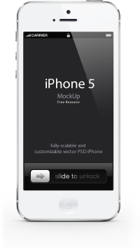

CSS 缩放器
=========================
什么？css还可以缩放？
> 其实主要还是里面对应的背景图片进行缩放，因为是跟样式捆绑的，所以我们叫样式缩放器。

## 背景

主要针对无线端，目前无线端高清屏幕越来越多，为了让网页得到更好的用户体验，我们往往需要为高清
屏幕提供2倍大小的背景图片。

但是，有时候用户所在的网络环境极差，完全无福消受高清版本，且某些用户甚至都没在使用高清屏幕，
于是我们又需要提供一份非高清版本的样式，根据条件自动加载。

于是，我们需要维护两份相似度很高的样式表，这样便带来了一定的维护成本。

## 解决方案

> 如何解决样式表针对不同的终端带来的维护成本问题？
>> 默认只提供高清版本，普通版本自动生成如何？
>>> Excellent, 此程序就是用来干这个事情的。

## 具体细节

针对高清屏幕的样式，我们往往会这么写。

```css
.ruler {
    background: url('xxx_200x200.png');
    background-size: 100px 100px;
}
```

把它转成普通版本的样式，需要两步。

1. 把图片`xxx_200x200.png`，通过`photoshop`缩小一倍， 变成`xxx_100x100.png`。
2. 去掉`background-size`一条。

最终变成。

```css
.ruler {
    background: url('xxx_100x100.png');
}
```

## 如何使用？

直接看demo吧！

### 外链样式表资源。

普通html文件

```html
<html>
    ...
    <!--引入style.css, 同时把它缩放成0.5倍。-->
    <link rel="stylesheet" type="text/css" href="/static/css/style.css?__scale=0.5">
    ...
    <style type="text/css">
    @import url('/static/css/style.css?__scale=0.5');

    .ruler {
        width: auto;
    }
    </style>
    ...
</html>
```

tpl文件

```html
<html>
    ...
    
    <!--如果使用高清版本，则使用原始高清版本-->
    <link rel="stylesheet" type="text/css" href="/static/css/style.css">
    
    <!--否则，引入style.css, 同时把它缩放成0.5倍。-->
    <link rel="stylesheet" type="text/css" href="/static/css/style.css?__scale=0.5">
    
    ...
</html>
```

### 内联样式表

普通html文件

```html
<html>
    ...
    <!--内嵌style.css, 同时把它缩放成0.5倍。-->
    <link rel="stylesheet" type="text/css" href="/static/css/style.css?__scale=0.5&amp;__embed">
    <!--或者-->
    <style type="text/css">
        @import url('/static/css/style.css?__scale=0.5&amp;__embed');
    </style>
    ...
</html>
```

tpl文件, 注意：这里用的是smarty插件语法，目的是为了能做到条件输出。
像普通的内联方式，是无法做到条件内联输出的。

```html

    <!--如果使用高清版本，则使用原始高清版本-->
    
    @import url('/static/css/style.css?__embed');
    

    <!--否则，内嵌style.css, 同时把它缩放成0.5倍。-->
    
    @import url('/static/css/style.css?__embed&amp;__scale=0.5');
    

```

也可以

```html

    <!--如果使用高清版本，则使用原始高清版本-->
    

    <!--否则，内嵌style.css, 同时把它缩放成0.5倍。-->
    

```

## 如何开起此插件？

* 安装npm包。
```bash
npm install -g fis-prepackager-css-scale
```
* 配置`fis-conf.js`，开起此功能。
```javascript
fis.config.set('modules.prepackager', 'css-scale,' + fis.config.get('modules.prepackager'));
```


## 担心图片自动缩放效果不好？

完全不用担心，效果与`photoshop`缩放的效果非常接近。

scale 0.2倍。

系统：
Photoshop: 

## 如果不想让某个背景图片自动缩放，怎么办？
默认样式表中所有图片，在此样式缩放的时候都会跟着缩放。如果某个图片不想被缩放，怎么办？

设置一个noScale属性就ok了。如下：

```css
.ruler {
    background: url(xxx.png?__noscale);
}
```

## 为什么使用`__embed`而不是熟悉的`__inline`?

此插件运行时期为fis compile之后，内联工作已经完成，所以针对此类内联需求，
需要用新语法`__embed`，然后在此插件中调用系统的compile，经过图片处理后再内联。

另外如果想要在fis的compile期就把词功能给做了，我们得改动fis的core部分，
牵扯的东西比较多，修改风险比较大。 所以暂时使用`__embed`, 作用与`__inline`完全一致。